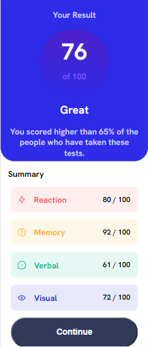

# Frontend Mentor - Solução de componente de resumo de resultados

## Visão geral

### O desafio

Os usuários devem ser capazes de:

- Veja o layout ideal para a interface, dependendo do tamanho da tela do dispositivo
- Veja os estados de foco e foco para todos os elementos interativos na página

### Captura de tela

### Links

- URL da solução: (https://github.com/LuizHF01/Frontend-mentor-01)
- URL do site ao vivo: (https://luizhf01.github.io/Frontend-mentor-01/)

## Meu processo

### Construído com

- Marcação HTML5 semântica
- Propriedades personalizadas CSS
- display flex
- Fluxo de trabalho móvel primeiro + media query para telas maiores

### O que eu aprendi

Na verdade não é bem oque eu aprendi, mas sim oque eu reforçei que já sabia, os posicionamentos de elementos dentro da div, alguns background com cor de texto usando hsla.

## Autor

- Github - (https://github.com/LuizHF01)
- Frontend Mentor - (https://www.frontendmentor.io/profile/LuizHF01)
